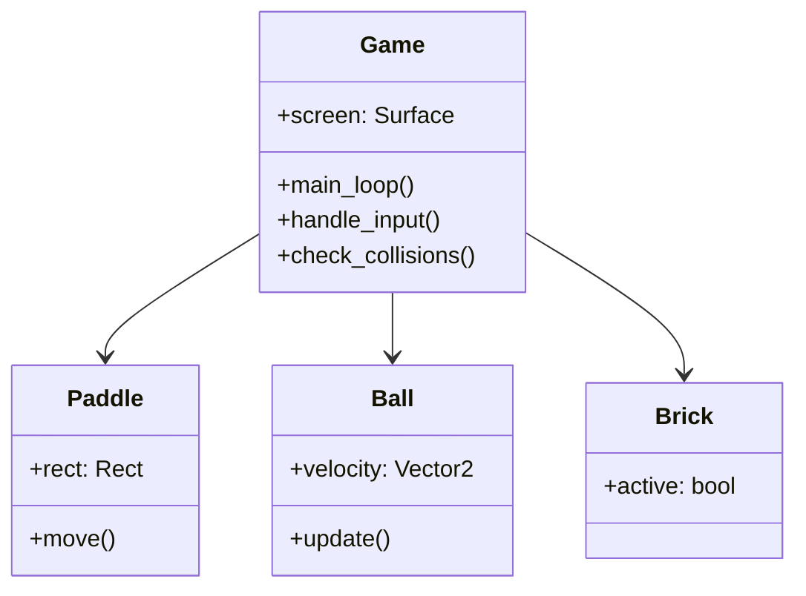

# NovaBreakout - 现代打砖块游戏

## 📖 项目简介
一款基于Python和Pygame开发的现代风格打砖块游戏，支持WASD和方向键双操作模式。游戏包含动态物理系统、渐变色彩砖块矩阵、实时计分系统和多生命机制，带来经典玩法与现代视觉的完美融合。

## 🎮 主要功能
- **双模式操控**：同时支持方向键和WASD键盘控制
- **动态物理引擎**：真实反弹角度计算与速度控制
- **渐变色砖块**：5种主题色自动生成的砖块矩阵
- **生命值系统**：3次容错机会，紧张感升级
- **智能碰撞检测**：精确的边界与物体碰撞判定
- **光影特效**：带边框的现代简约视觉风格
- **即时反馈**：实时计分与游戏状态显示
- **重启机制**：一键重置游戏进度

## 🛠️ 运行环境
- Python 3.8+
- Pygame 2.0+

## 🕹️ 操作指南
| 按键 | 功能 |
|------|------|
| ← / → | 左/右移动挡板 |
| A / D | 左/右移动挡板 |
| R     | 重新开始游戏 |
| ESC   | 退出游戏 |

**游戏规则**：
- 击碎所有砖块即可获胜
- 每次漏球扣除1点生命值
- 不同颜色砖块统一计分（10分/块）
- 3次生命值耗尽游戏结束

## 📐 技术实现
### 核心架构


### 关键算法
1. **动态角度生成**：
```python
# 生成30-150度之间的随机角度
base_angle = random.uniform(30, 150)
direction = Vector2(1, 0).rotate(base_angle)
```

2. **精确碰撞检测**：
```python
overlap_x = min(ball.right, brick.right) - max(ball.left, brick.left)
overlap_y = min(ball.bottom, brick.bottom) - max(ball.top, brick.top)
```

3. **挡板击打效果**：
```python
offset = (ball.centerx - paddle.centerx) / (PADDLE_WIDTH/2)
velocity.x = offset * BALL_SPEED * 1.2
```

## 📜 开源协议
[MIT License](LICENSE)

## 🤝 参与贡献
欢迎提交Pull Request或Issue，建议包括：
- 新关卡设计
- 特效系统优化
- 音效系统集成
- 难度调节选项

---

> "游戏是通往无限可能的门户" —— 诺亚·法尔斯坦  
> 在NovaBreakout的世界里，每一块砖的破碎都是新星诞生的礼赞！✨
